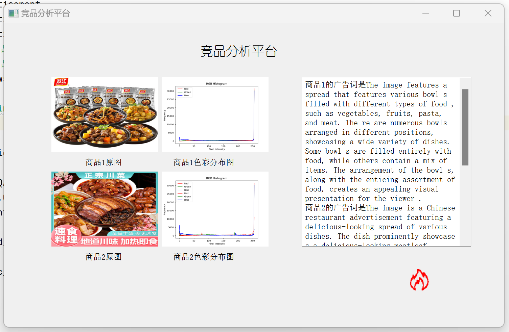

# QT_meituan
## 这个项目起源于美团商业比赛，具体架构如下

## 具体的代码架构如下

## 使用步骤
安装requirements.txt

整个项目代码入口是Mainwindow.py

## 需要修改部分有
这里使用文心一言，下面url的XXXX部分修改为自己的Secret key,(advertisement.py)

这里使用智谱AI，下面url的XXXX部分修改为自己的Secret key,(suggestion2.py)

这里使用智谱AI，下面url的XXXX部分修改为自己的Secret key(suggestionPart.py)

## 其中的效果展示部分如下

